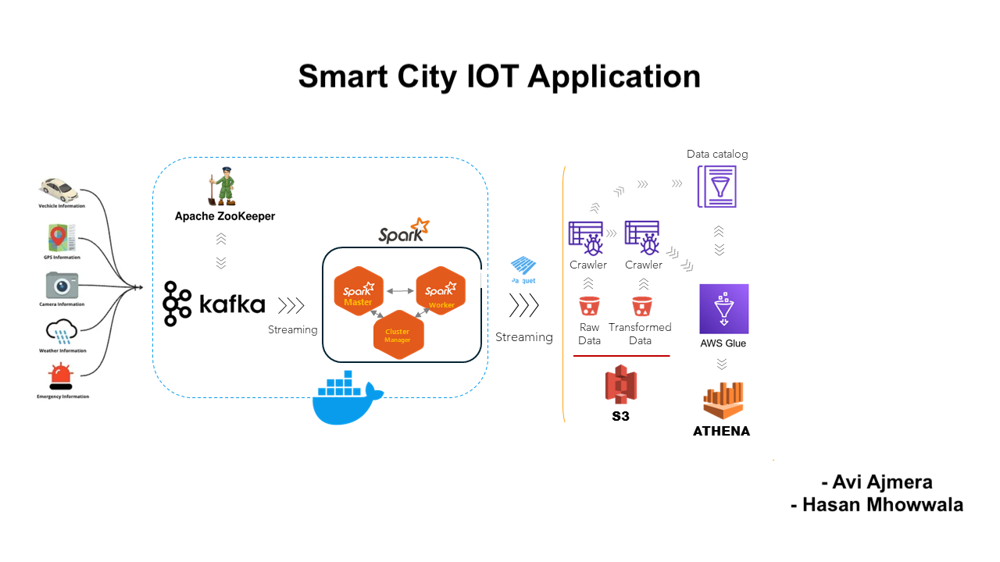

# Smart City IoT Data Streaming Project

The **Smart City IoT Data Streaming Project** provides a robust and scalable pipeline for real-time data streaming, processing, and analytics. It leverages IoT, Kafka, Spark, and AWS technologies to simulate and process data related to urban mobility and vehicle monitoring, offering actionable insights for smarter city planning and management.

---

## Objectives

1. **Real-Time Monitoring**:
   - Track GPS locations of vehicles for route optimization.
   - Log weather conditions to provide environmental context.
   - Capture emergency events to ensure timely interventions.

2. **Data Insights**:
   - Enable real-time analysis for traffic, weather, and incidents.
   - Provide city planners and administrators with actionable insights.

3. **Scalability and Modularity**:
   - Modular architecture for seamless integration with live IoT devices and additional data sources.

---

## Project Architecture

The following diagram illustrates the end-to-end architecture of the Smart City IoT Data Streaming Project:



---

## Features

### Required Features
1. **IoT Data Simulation**:
   - Simulates GPS data, weather updates, vehicle telemetry, and emergency alerts.
   - Python scripts generate continuous streams with random deviations for realism.

2. **Real-Time Data Streaming**:
   - Apache Kafka streams data using a publish-subscribe model.
   - Topics include `gps_topic`, `weather_topic`, `emergency_topic`, and `vehicle_topic`.

3. **Real-Time Processing**:
   - Apache Spark processes streams from Kafka, transforming data into enriched datasets.

4. **Cloud Storage**:
   - Raw and processed data is stored in Amazon S3 for analytics.
   - AWS Glue catalogs the datasets for advanced querying.

### Additional Features
1. **Predictive Analytics Ready**:
   - Foundation for incorporating machine learning for traffic and weather forecasting.

2. **Extensible Design**:
   - Can integrate live IoT devices and real-world datasets.

3. **Cloud Optimization**:
   - Supports Redshift integration for advanced analytics.

---

## Technologies Used

- **Python**: Data simulation and Kafka producer scripts.
- **Apache Kafka**: Reliable, scalable data streaming.
- **Apache Spark**: Real-time data processing.
- **Docker**: Containerization and orchestration.
- **AWS S3 & Glue**: Data storage and cataloging.

---

## Setup Instructions

### Prerequisites
1. **Install Docker**:
   - [Get Docker](https://docs.docker.com/get-docker/)

2. **Install Python and Virtual Environment**:
   - Python 3.8+ is recommended.
   - Install `virtualenv`: `pip install virtualenv`.

3. **AWS Setup**:
   - Create an AWS S3 bucket.
   - Generate your AWS Access Key and Secret Key.

---

### Steps

1. **Clone the Repository**:
   ```bash
   git clone https://github.com/your-repository-url.git
   cd Smartcity
   ```

2. **Set Up Virtual Environment**:
   ```bash
   virtualenv venv
   source venv/bin/activate  # Linux/Mac
   venv\Scriptsctivate     # Windows
   ```

3. **Install Dependencies**:
   ```bash
   pip install -r requirements.txt
   ```

4. **Configure AWS**:
   Update the `aws_config.py` file:
   ```python
   AWS_ACCESS_KEY = "your-access-key"
   AWS_SECRET_KEY = "your-secret-key"
   S3_BUCKET_NAME = "your-bucket-name"
   ```

5. **Run Docker Compose**:
   ```bash
   docker-compose up
   ```

6. **Execute Main Script**:
   ```bash
   python jobs/main.py
   ```

---

## Project Demo

[Watch the Project Demo](https://drive.google.com/file/d/1PvaLuydNkUHjUOXqegPr_nYb0a0icJR_/view?usp=drivesdk)

---

## Usage

- **Simulating Data**: Python scripts generate streams for GPS, weather, telemetry, and emergency events.
- **Real-Time Processing**: Spark consumes Kafka streams and processes data.
- **Data Storage**: Data is written to S3 in Parquet format for further analysis.

---

## Future Enhancements

1. **Integration of Visualization Tools**:
   - Add Power BI/Tableau dashboards to display vehicle tracking, weather trends, and incident impacts.

2. **Advanced Querying with Redshift**:
   - Store data in AWS Redshift for SQL-based queries.

3. **Live IoT Device Integration**:
   - Replace simulated data with real IoT sensors for GPS, weather, and emergency updates.

4. **Machine Learning**:
   - Integrate predictive analytics to forecast traffic delays and weather impacts.

5. **Kubernetes**:
   - Use Kubernetes for dynamic scaling and multi-region deployment.

---
